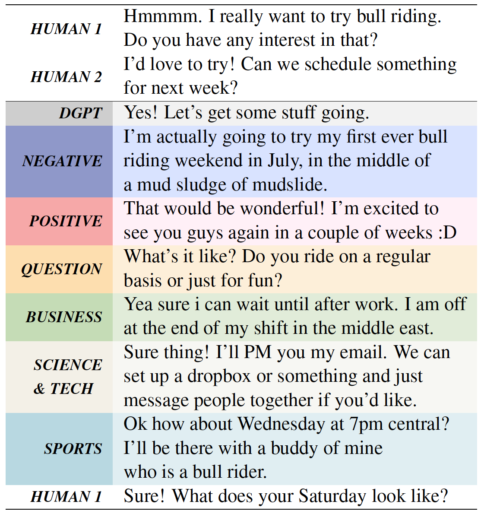

# Plug-and-Play Conversational Models
 [](https://opensource.org/licenses/MIT) 


This is the implementation of the paper:

**Plug-and-Play Conversational Models**. [**Andrea Madotto**](https://andreamad8.github.io), Etzuko Ishii, [**Zhaojiang Lin**](https://zlinao.github.io/), [**Sumanth Dathathri**](https://dathath.github.io/), Pascale Fung [[PDF]](https://www.aclweb.org/anthology/2020.findings-emnlp.219/) **EMNLP2020** (findings)
 
If you use any source codes or datasets included in this toolkit in your work, please cite the following paper. The bibtex is listed below:
<pre>
@inproceedings{madotto2020plug,
  title={Plug-and-Play Conversational Models},
  author={Madotto, Andrea and Ishii, Etsuko and Lin, Zhaojiang and Dathathri, Sumanth and Fung, Pascale},
  booktitle={Proceedings of the 2020 Conference on Empirical Methods in Natural Language Processing: Findings},
  pages={2422--2433},
  year={2020}
}
</pre>

## Abstract
There has been considerable progress made towards conversational models that generate coherent 
and fluent responses; however, this often involves training large language models on large dialogue datasets, such as Reddit.
These large conversational models provide little control over the generated responses, and this control is further limited in the absence of annotated conversational datasets for attribute specific generation 
that can be used for fine-tuning the model. In this paper, we first propose and evaluate plug-and-play methods 
for controllable response generation, which does not require 
dialogue specific datasets and does not rely on fine-tuning a large model.
While effective, the decoding procedure induces considerable computational overhead,
rendering the conversational model unsuitable for interactive usage.
To overcome this, we introduce an approach that does not require 
further computation at decoding time, while also does not require any fine-tuning of a large language model. We demonstrate, through extensive automatic and human evaluation, a high degree of
control over the generated conversational responses with regard to multiple 
desired attributes, while being fluent. 

## Plug-and-Play Conversational Models (PPCM)
<p align="center">

</p>

## Basic Usage

### Dependencies
Create a `python3.6` virtual environment and run `pip install -r requirements.txt`.

### Discriminator Training
```
python dialogGPT_discr.py --save_model --dataset sentiment --cached --epochs 100 
python dialogGPT_discr.py --save_model --dataset daily_dialogue_act --cached --epochs 100 
python dialogGPT_discr.py --save_model --dataset TC_AG_NEWS --cached --epochs 50 
python dialogGPT_discr.py --save_model --dataset TC_SogouNews --cached --epochs 50 
python dialogGPT_discr.py --save_model --dataset TC_DBpedia --cached --epochs 10 
python dialogGPT_discr.py --save_model --dataset TC_YahooAnswers --cached --epochs 10 
```
### Run PPLM
By omitting the `--evaluate` flag, you can run PPLM in an interactive mode.
```
python main.py -D AG_NEWS --label_class 0 --length 30 --num_samples 10 --evaluate --verbose --all_starter --wd
python main.py -D AG_NEWS --label_class 1 --length 30 --num_samples 10 --evaluate --verbose --all_starter --wd
python main.py -D AG_NEWS --label_class 2 --length 30 --num_samples 10 --evaluate --verbose --all_starter --wd
python main.py -D AG_NEWS --label_class 3 --length 30 --num_samples 10 --evaluate --verbose --all_starter --wd
python main.py -D sentiment --label_class 3 --length 30 --num_samples 10 --evaluate --verbose --all_starter
python main.py -D sentiment --label_class 2 --length 30 --num_samples 10 --evaluate --verbose --all_starter
python main.py -D daily_dialogue_act --label_class 1 --length 30 --num_samples 10 --evaluate --verbose --all_starter
```

### Run Adapter 
```
python train_supervised_adapter.py --dataset SENT --label very_negative --iter 75 --lr 6.25e-4
python train_supervised_adapter.py --dataset SENT --label very_positive --iter 25
python train_supervised_adapter.py --dataset QUEST --label question --iter 25
python train_supervised_adapter.py --dataset TOPI --label Business --iter 25
python train_supervised_adapter.py --dataset TOPI --label SciTech --iter 25
python train_supervised_adapter.py --dataset TOPI --label Sports --iter 25
```


## Reproducibility

You can **simply run** `./download_data.sh` to download and extract all required files, or you can perform the required actions manually, by following the steps outlined bellow:  

### Manual setup

***Dataset***

Download the [**datasets**](https://drive.google.com/file/d/1LvAsTzJWIEZsb5orG4vvJz0376mH27l2/)
```console
❱❱❱ unzip data.zip
```

***DialoGPT***

Download [**dialoGPT**](https://drive.google.com/file/d/1V8juN486jpeqPhKrGeuJ8WcpaCAy4D3-/view?usp=sharing)
```console
❱❱❱ unzip dialoGPT.zip
❱❱❱ mv dialiGPT models
```
***Discriminators***

Download the [**discriminators**](https://drive.google.com/file/d/1IzbfGOKkbbEXaoyVxBI0kD_bWODKjVpn/view?usp=sharing)
```console
❱❱❱ unzip discriminators.zip
❱❱❱ mv discriminators models
```

***Scorers***

Download the [**scorers**](https://drive.google.com/file/d/1rxgYyYEpWVH0qd2uxJQxC5uVIaApJMMf/view?usp=sharing)
```console
❱❱❱ unzip scorers.zip
❱❱❱ mv scorers models
```

***Reproducibility***

Download the [**generated responses**](https://drive.google.com/file/d/1gZmaQ94kQmf1-N04LmW7rN-gOrt-Sa46/view?usp=sharing)
```console
❱❱❱ unzip evaluate.zip
❱❱❱ mv evaluate results
❱❱❱ python evaluate.py
```
In each folder you can find response generated by PPLM using multple styles. This are use to train each of the adapter using ```train_supervised_adapter.py```.

Download the [**Human Evaluation Score**](https://drive.google.com/file/d/1BEtFR694-8x61_-iANr2TMVck8QRqkA4/view?usp=sharing)
```console
❱❱❱ unzip human_evaluation.zip
```
here you can find the jupiter notebook to replicate the human evaluation results and the human judgment scores.

***Run***
Check the experiment_runner folder to see how to run the generation. 

## Toxicity
For researcher working on abusive language, we have also responses generated using a toxic classifer. We can release it upon request exclusively for research purposes. 


## Acknowledgement
We would like to thanks the [**MLC**](http://mlcollective.org/) for the feedback on the earlystage of the work, and expecially [Jason Yosinski](http://yosinski.com/). This repository is implemented base on [**Huggingface**](https://github.com/huggingface/transfer-learning-conv-ai)


